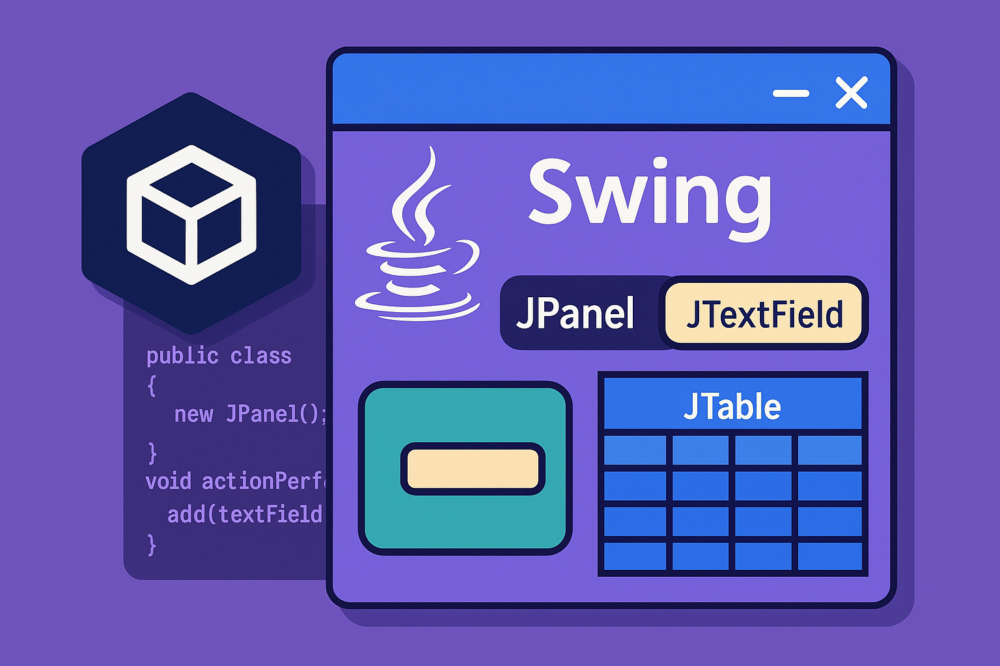

# ☕ Java Swing and Dev Containers: The Return of a Containerized Classic 🚀

<div align="center">

[](https://www.youtube.com/c/GiselaTorres?sub_confirmation=1)
[](https://github.com/0GiS0)
[](https://www.linkedin.com/in/giselatorresbuitrago/)
[](https://twitter.com/0GiS0)

**[📖 Español](README.md) | [🇬🇧 English](README.en.md)**

</div>



Hello developer 👋🏻! In this repo you'll find everything you need to set up a development environment for **Java Swing 🤸🏻** using **Dev Containers**.

> 📖 For more detailed information about this project, check out the article: [**Java Swing and Dev Containers: The return of a containerized classic**](https://www.returngis.net/2025/10/java-swing-y-dev-containers-el-regreso-de-un-clasico-contenarizado/) (Spanish)

## 🎯 Why do this?

Because we want to use **Visual Studio Code 🧑🏻‍💻** with Java Swing applications while taking advantage of the most complete version of **GitHub Copilot 🤖** within the environment. No heavy installations or endless configurations: just open the container and start coding!

## 📋 Host Requirements

To run this project you'll need to have the following installed on your machine:

- [Docker](https://docs.docker.com/get-docker/)
- [Visual Studio Code](https://code.visualstudio.com/download)
- [Dev Containers Extension for Visual Studio Code](https://marketplace.visualstudio.com/items?itemName=ms-vscode-remote.remote-containers)

### X11 Configuration (Linux and macOS)

#### Linux
Make sure you have an X11 server installed (most distributions have it by default).

#### macOS
Install [XQuartz](https://www.xquartz.org/) easily using [Homebrew](https://brew.sh/):

```bash
brew install --cask xquartz
```

Once installed, start XQuartz and go to `Preferences > Security` and check the `Allow connections from network clients` option. Then restart XQuartz. You can do this through the command line:

```bash
open -a XQuartz
defaults write org.xquartz.X11 nolisten_tcp -bool false
DISPLAY=:0 /opt/X11/bin/xhost +
```

If you want to restrict it after using it, you can run:

```bash
DISPLAY=:0 /opt/X11/bin/xhost -
```

To verify this configuration works correctly, open this repo inside a container and run:

```bash
echo $DISPLAY
xeyes
```

### Windows (WSL2/WSLg)

For **Windows with WSL2/WSLg**, there's no need to install an additional X11 server, since **WSLg already includes native support for Linux graphical applications**.

All you need is:
- **Docker Desktop** with **WSL2**
- **Dev Containers Extension** in Visual Studio Code
- Make sure VS Code is configured to use **WSL when running Dev Containers**

If you launch the container on Windows, run:

```bash
xeyes
```

You should see the eyes 👀 following your cursor!

## 🚀 Quick Start

### Option 1: Use the script (recommended)

Once you have the container open in VS Code, simply run:

```bash
./run.sh
```

If you're on WSL2/WSLg, run:

```bash
./run-wsl2.sh
```

This script compiles and runs the application automatically.

### Option 2: Manual steps

```bash
cd src
javac -cp ../lib/mysql-connector-j-8.2.0.jar *.java
java -cp .:../lib/mysql-connector-j-8.2.0.jar CallForPaperApp
```

## 📦 Call for Paper Application

This project includes a **complete "Call for Paper" application** with **MySQL integration using JDBC** (the classic way to connect Java with databases).

### ✨ Features

- **☕ Swing GUI** - Graphical interface with Java Swing
- **🐬 MySQL Database** - Database in Docker container
- **🔗 JDBC Connection** - Connection to MySQL using pure JDBC (no ORM)
- **📊 Data Management** - Create, read, update, and delete talk proposals
- **✅ Unit Tests** - Unit tests with JUnit and Mockito
- **🐳 Dev Containers** - Reproducible and isolated environment

### 📁 Project Structure

```
java-swing-demo/
├── src/                              # Source code
│   ├── CallForPaperApp.java         # ☕ Main application with UI
│   ├── DatabaseConnection.java      # 🔗 JDBC connection handling
│   ├── TalkProposal.java            # 📝 Data model
│   ├── ProposalDAO.java             # 📊 Data Access Object
│   └── Controller.java              # 🎮 Application logic
│
├── test/                             # Tests
│   ├── DatabaseConnectionTest.java
│   ├── ProposalDAOTest.java
│   └── TalkProposalTest.java
│
├── lib/                              # External dependencies
│   ├── mysql-connector-j-8.2.0.jar  # MySQL JDBC driver
│   ├── junit-4.13.2.jar
│   ├── hamcrest-2.2.jar
│   ├── mockito-core-4.8.0.jar
│   ├── byte-buddy-1.12.16.jar
│   └── objenesis-3.2.jar
│
├── .devcontainer/                    # Dev Containers configuration
│   ├── devcontainer.json            # 🐳 Container configuration
│   ├── Dockerfile                   # Custom image
│   ├── docker-compose.yml           # Services (Java + MySQL)
│   └── init.sql                     # Database initialization script
│
├── compile.sh                        # 🔨 Compile script
├── run.sh                            # 🚀 Run script
├── test.sh                           # ✅ Tests script
├── compile-wsl2.sh                   # 🪟 Compile script for WSL2
├── run-wsl2.sh                       # 🪟 Run script for WSL2
├── test-wsl2.sh                      # 🪟 Tests script for WSL2
└── README.md                         # This file
```

### 🐬 Database

The container includes **MySQL 8.0** pre-configured with:

- **Database**: `callforpaper`
- **User**: `developer`
- **Password**: `developer123`
- **Host** (from inside the container): `mysql`
- **Port**: `3306`

The `talks` table is created automatically with the following structure:

```sql
CREATE TABLE talks (
    id INT AUTO_INCREMENT PRIMARY KEY,
    title VARCHAR(255) NOT NULL,
    description TEXT,
    speaker_name VARCHAR(255),
    speaker_email VARCHAR(255),
    created_at TIMESTAMP DEFAULT CURRENT_TIMESTAMP
);
```

## 🧪 Running Tests

To run the unit tests:

```bash
./test.sh
```

Or on WSL2:

```bash
./test-wsl2.sh
```

The tests include:
- ✅ Database connection tests
- ✅ CRUD operations tests
- ✅ Data model tests

## 📚 Additional Documentation

For more detailed technical information about the JDBC implementation and architecture, check the [JDBC_GUIDE.md](JDBC_GUIDE.md) file.

## 💡 Troubleshooting

### The GUI doesn't open on macOS

- Make sure you have XQuartz installed and running
- Verify that you've executed the commands to enable remote connections:
  ```bash
  open -a XQuartz
  defaults write org.xquartz.X11 nolisten_tcp -bool false
  DISPLAY=:0 /opt/X11/bin/xhost +
  ```

### MySQL connection error

- Check that Docker is running
- Make sure the MySQL service in the container has started correctly
- Try restarting the Dev Container

### Scripts don't have execute permissions

```bash
chmod +x *.sh
```

## 🏗️ Technology Stack

| Component | Version | Purpose |
|-----------|---------|----------|
| **Java** | JDK 17 | Main language |
| **Swing** | JDK builtin | Desktop UI framework |
| **MySQL** | 8.0 | Relational database |
| **JDBC** | MySQL Connector 8.2.0 | Database connection driver |
| **JUnit** | 4.13.2 | Testing framework |
| **Mockito** | 4.8.0 | Mocking framework |
| **Docker** | Latest | Containerization |
| **VS Code** | Latest | IDE |

---

<div align="center">

**Made with ❤️ by [Gisela Torres](https://www.returngis.net/)**

</div>
