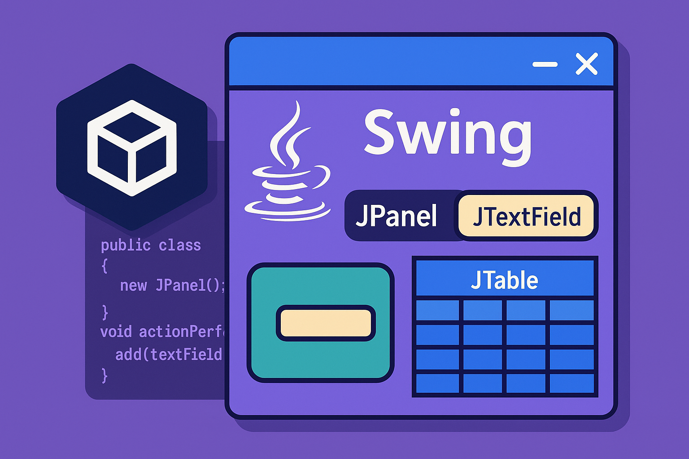

# Cómo montar un entorno de desarrollo para Java Swing

<div align="center">

[](https://www.youtube.com/c/GiselaTorres?sub_confirmation=1)
[](https://github.com/0GiS0)
[](https://www.linkedin.com/in/giselatorresbuitrago/)
[](https://twitter.com/0GiS0)

</div>



¡Hola developer 👋🏻! En este repo encontrarás todo lo que necesitas para levantar un entorno de desarrollo para Java Swing 🤸🏻 gracias a Dev Containers.


## Requisitos del host

Para poder ejecutar este proyecto necesitarás tener instalado lo siguiente en tu máquina:

- [Docker](https://docs.docker.com/get-docker/)
- [Visual Studio Code](https://code.visualstudio.com/download)
- [Extensión de Dev Containers para Visual Studio Code](https://marketplace.visualstudio.com/items?itemName=ms-vscode-remote.remote-containers) 

X11 server (solo para Linux y MacOS):

- Linux: Asegúrate de tener instalado un servidor X11 (la mayoría de las distribuciones lo tienen por defecto).
- MacOS: Instala [XQuartz](https://www.xquartz.org/) puedes hacerlo de forma sencilla usando [Homebrew](https://brew.sh/):

```bash
brew install --cask xquartz
```

Una vez instalado, inicia XQuartz y ve a `Preferences > Security` y marca la opción `Allow connections from network clients`. Luego, reinicia XQuartz. Puedes hacerlo a través de la linea de comandos:

```bash
open -a XQuartz
defaults write org.xquartz.X11 nolisten_tcp -bool false
DISPLAY=:0 /opt/X11/bin/xhost +
```

Si quieres restringirlo después de usarlo, puedes ejecutar:

```bash
DISPLAY=:0 /opt/X11/bin/xhost -
```

Para comprobar que esta configuración funciona correctamente abre este repo dentro de un contenedor y ejecuta:

```bash
echo $DISPLAY
xeyes
```


## Windows

En el caso de Windows con WSL2/WSLg, no es necesario instalar un servidor X11 adicional, ya que WSLg ya incluye soporte para aplicaciones gráficas de Linux de forma nativa.

Por lo que lo único que necesitas es tener instalado Docker Desktop con WSL2 y la extensión de Dev Containers en Visual Studio Code.

Si arrancas el contenedor en Windows solamente lanzando este comando:

```bash
xeyes
```

Ya deberías de ver los ojos 👀 siguiendo el cursos del ratón.

## Probar el ejemplo de Java Swing

Para invocar este proyecto, siga estos pasos:

```bash
cd src
javac -cp ../lib/mysql-connector-j-8.2.0.jar *.java
java -cp .:../lib/mysql-connector-j-8.2.0.jar CallForPaperApp
``` 

O simplemente ejecute:

```bash
./run.sh
```

## Call for Paper Application with MySQL JDBC

Este proyecto ahora incluye una aplicación completa de "Call for Paper" con integración a MySQL usando JDBC (forma clásica de conectar Java con bases de datos).

### Características

- **Swing GUI** - Interfaz gráfica con Java Swing
- **MySQL Database** - Base de datos en contenedor Docker
- **JDBC Connection** - Conexión a MySQL usando JDBC puro (sin ORM)
- **Data Management** - Crear, leer, actualizar propuestas de charlas

### Estructura

```
src/
 ├── CallForPaperApp.java      # Aplicación principal con UI
 ├── DatabaseConnection.java   # Manejo de conexiones JDBC
 ├── TalkProposal.java         # Modelo de datos
 └── ProposalDAO.java          # Data Access Object

lib/
 └── mysql-connector-j-8.2.0.jar  # Driver JDBC de MySQL

.devcontainer/
 ├── docker-compose.yml        # Configuración de servicios
 ├── init.sql                  # Script de inicialización de BD
 └── Dockerfile               # Imagen del contenedor
```

### Base de Datos

El contenedor incluye MySQL 8.0 con:
- Base de datos: `callforpaper`
- Usuario: `developer`
- Contraseña: `developer123`
- Host (desde el contenedor): `mysql`

### Para más información

Ver el archivo [JDBC_GUIDE.md](JDBC_GUIDE.md) para documentación detallada sobre la implementación JDBC.